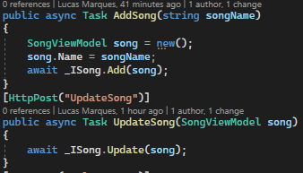

# Semana 9 - Arquitetura em Camadas
Nesta semana resolvi criar uma API que faz o papel de um CRUD. Utilizei o banco de dados SQL para inserir as informações referente as músicas.

Utilizei do Entity Framework, do metodo EnsureCreated() para verificar quanto a existência do banco de dados e caso necessário cria-lo e utilizei de Data Anotations para definir as colunas e seus tipos na classe Model desta solution. Desta forma não foi necessário fazer nenhuma migration somente utilizando  (mais detalhes na classe ContextBase).

## 1 - Estrutura na solution
Deixei a estrutura da Solution com 4 projetos, deixei as 3 camadas Business Logic, User Interface e Data Acess. E fiz também separadamente a Model.

## 2 - Interface no Swagger
Criei os métodos na controller e no Swagger fica deste jeito:

## 3 - Primeira utilização
Na primeira utilização depois do execute como ainda não há banco de dados o método que citei EnsureCreated() cria o banco de dados. 

## 4 - Chamando os métodos
A seguir a chamada dos métodos:

<h3>AddSong</h3> 
 Adicionando uma música:

<h3>DeleteSong</h3> 
 Apagando uma música:

<h3>GetSongById</h3> 
 Obtendo a música pelo Id vinculado a ela:

<h3>ListSong</h3> 
 Listando todas as músicas presentes no banco de dados:

<h3>UpdateSong</h3> 
 Alterando o nome de uma música existente:

## 4 - Instalação em outras maquinas
Acredito que para a utilização da API em outras máquinas somente é necessário alterar o "Server" Connection String com o endereço da sua máquina, o campo deve ser alterado na classe ContextBase que está na camada de DataAcess. 

## 5 - Dificuldades
Quando o banco foi automaticamente não percebi que ele iria definir o ID automaticamente, se eu informasse o ID quando fosse fazer um AddSong na Swagger eu era bloqueado por IDENTITY_INSERT OFF. Para não ter que mudar toda a estrutura da Interface eu modifiquei o método na própria controller.

É possivel ver no metodo do UpdateSong que ele recebe como parametro um objeto do tipo SongViewModel, e da mesma forma estava na AddSong, por este motivo o "modelo base" que o Swagger passava era com id e name, após a atualização que fiz acima coloquei como parametro um objeto do tipo string, instanciei um objeto do tipo SongViewModel como "song" e atribui o campo "Name" do objeto song a songName(parametro que foi alterado). Assim o sistema meio que manda o Id(que é o outro atributo de SongViewModel) como nulo, mas, já que ele é auto implementado o sistema não vê problema nisso.
